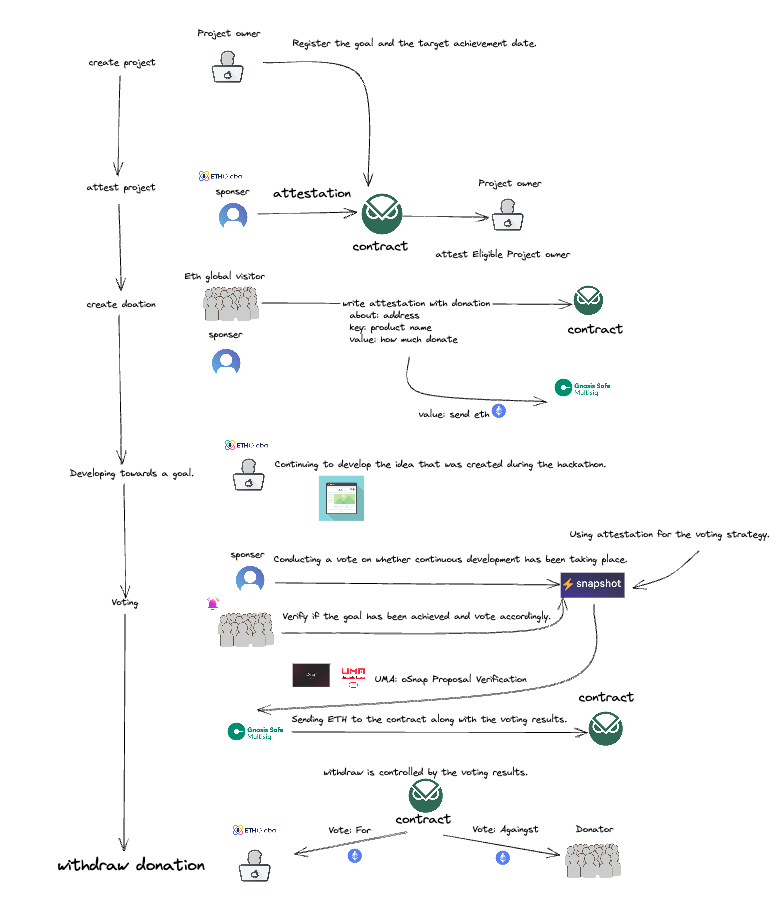

# HackathonAttestation Station Interface

- Empowering Sustainable Development with Attestation-based Donations

Our hackathon proposal involves creating a product that allows post-hackathon projects to receive donations from potential future users, based on attestations from sponsors.

[](https://youtu.be/rBesMSd0GzM)

This product utilizes smart contracts and an efficient interface while effectively leveraging oSnap, attestations, and gnosis-safe features to ensure secure funds management and support reception.

---

## Motivation

Challenges in Hackathon-based project. It's very tough! 😢

1. Many projects struggle with insufficient funds.

2. Sponsors face difficulties in monitoring and evaluating the progress of projects.

3. Uncertainty about user adoption and engagement.

-> a seamless donation ecosystem post-hackathon would yield considerable advantages. :satisfied:

---

## Solution for Post-hackathon

In the context of post-hackathon support, attestation from strong investors, early donations from potential users, and strong financial incentives tied to milestones can effectively contribute to a project’s success.

1. Attestation from Strong Investors:

   After a hackathon, securing support from reputable and experienced investors can significantly benefit a project. Such backing not only provides funding but also offers credibility and validation. Investors often have industry connections and expertise that can help guide the project towards success. Additionally, their endorsement may attract other investors and create a positive image for the project in the market.

2. Early Donations from Potential Users:

   Receiving early donations from potential users after a hackathon can demonstrate genuine interest in the project and validate its value proposition. It shows that people believe in the idea and are willing to support its development financially. This early support can also create a strong user base and foster community engagement, which may lead to invaluable feedback, word-of-mouth marketing, and user-driven growth.

3. Strong Financial Incentives upon Reaching Milestones:

   Offering strong financial incentives to the project team if they reach specific milestones can help keep them motivated and focused on achieving their goals. By tying incentives to the accomplishment of milestones, project teams are encouraged to work diligently and efficiently, leading to a higher likelihood of success.

---

## Key Service Providers

Our product uniquely combines OP Attestation, oSnap, and Gnosis Safe to create a secure and accountable system for receiving donations upon achieving specific milestones.

1. OP Attestation: By integrating OP Attestation into the product, we can establish a system where sponsors can make attestations about project owners and their Ethereum addresses. This process validates the project’s credibility and ensures that only trustworthy projects can receive donations.

2. oSnap: Our product leverages oSnap’s benefits, such as decentralization, security, flexibility, and interoperability, to facilitate an efficient and reliable donation system. With oSnap, we can create customized smart contracts tailored to each project’s needs and milestones. This ensures that donations are only released when projects achieve specific milestones, providing a level of accountability for project owners.

3. Gnosis Safe: By incorporating Gnosis Safe, our product provides a secure decentralized custody solution for managing collective assets. This platform enables secure funds management, ensuring that donations are safely held until projects meet their milestones.

## Build on Gnosis Chain

Gnosis Chain is an innovative blockchain network that offers a number of attractive features, particularly its cost-effective and stable gas pricing. One of the key advantages of Gnosis Chain is the ability to use its safe, or decentralized storage, at a significantly lower cost than other blockchain platforms. This makes it an ideal choice for users looking to minimize their expenses while maintaining the security and privacy of their digital assets.

Additionally, Gnosis Chain's gas pricing is pegged to the US dollar, which provides a high level of stability. Unlike other blockchain networks that may experience volatile gas fees, Gnosis Chain ensures that users can consistently predict and manage their transaction costs. This stability makes the platform more appealing to a wider audience, as it reduces the barriers to entry and simplifies the user experience.

In summary, Gnosis Chain stands out in the blockchain space due to its cost-effective safe usage and stable, dollar-pegged gas pricing. These features make it a compelling choice for individuals and businesses looking to leverage the benefits of decentralized storage without the financial burden or unpredictability associated with other platforms.

---

## Key Features

Our product benefits all parties involved...

- Sponsors can effectively support and monitor projects
- Project owners receive the necessary funding and validation based on their performance
- Donors can confidently contribute, knowing that their donations are tied to the achievement of milestones and can be refunded if the project does not meet expectations.

This creates a win-win situation for everyone involved in the project’s development and growth.

## Detaild Flow

[](https://youtu.be/rBesMSd0GzM)

---

## Run Locally

```
yarn
yarn start
npx hardhat run scripts/deploy.ts --network gnosis
npx hardhat run --network gnosis scripts/setting.ts
<!-- npx hardhat run --network optimism-goerli scripts/deploy.ts -->


```

https://marpit.marp.app/usage

slide-deck.md
npx @marp-team/marp-cli@latest slide-deck.md --pdf
npx @marp-team/marp-cli@latest slide-deck.md -o output.pdf

npx @marp-team/marp-cli@latest slide-deck.md --pptx
npx @marp-team/marp-cli@latest slide-deck.md -o output.pptx

### Tests.

```
REPORT_GAS=true npx hardhat test
```

---

## Future Phase Items

- [ ] Input validation for addresses

## Related Links

- OP Attestation
  An open source interface for Optimism's AttestationStation -- a data primative for making arbitrary attestations about Ethereum addresses -- [OP Labs' Official Documentation](https://community.optimism.io/docs/governance/attestation-station/#).
- oSnap
  oSnap can offer benefits such as decentralization, security, flexibility, transparency, interoperability, and strong developer support, making it a valuable tool --
  [oSnap Quick Start](https://docs.uma.xyz/developers/osnap/osnap-quick-start).
- Gnosis Safe
  Safe is the most trusted decentralized custody protocol and collective asset management platform on Ethereum and the EVM. --
  [Safe](https://safe.global/).

## License

MIT

## Acknowledgements

Thank you [Zain](https://twitter.com/zainbacchus) and Thank you [Kevin](https://twitter.com/lanceplaine) for creatting sample OP attestation interface.

- https://github.com/sbvegan/attestation-station-interface
