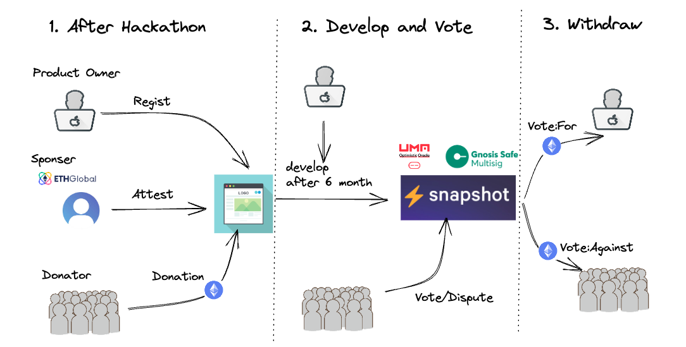

# **Hackathon Attestation**

Empowering Sustainable Development with Attestation-based Donations

https://marp.app/

---

# Motivation

Challenges in Hackathon-based project. It's very tough! 😢

1. Many projects struggle with insufficient funds.

2. Sponsors face difficulties in monitoring and evaluating the progress of projects.

3. Hard to confirm how much a project is in need from user side

---

# In my case...

https://ethglobal.com/showcase/phi-land-2f6hf

https://ethglobal.com/showcase/phi-hs50f

---

# Solution

- Attest
- Early Donation
- Strong incentive

-> a seamless donation ecosystem post-hackathon would yield considerable advantages. :satisfied:

---

<!-- # System Flow -->

<!-- - Creating an inclusive donation environment that anyone can participate in. -->

<!-- Project owner receive all of the donation funds after voting. -->

---

# Key Service Providers

- oSnap
- OP attestation
- Safe
  => Next. Lifecycle of Hackathon Project

---

<!-- # Lifecycle of Hackathon Project -->

1. Create Phase
   After the hackathon, participants register their projects.

2. Eligible Phase (using OP attestation)
   The sponsors of EthGlobal select projects (eligible for funding).

3. Donation Phase
   Anyone make a donation and write an attestation.

4. Vote Phase (using UMA’s oSnap.)
   Donator vote whether the project has continued development

5. Withdraw Phase
   For: project can receive all of the donation funds.
   Against: donors withdraw the funds.

---

# Step1:

After the hackathon, participants will register their projects as donation targets. During registration, participants can specify their project goals.

---

# Step2:

Eligible Phase
The sponsors of EthGlobal Tokyo will select projects that are eligible for funding.

---

# Step3:

Donation Phase
Users or sponsors who like a particular project can make a donation and write an attestation. All donations will be sent to Safe.

---

develop
like phi

---

# Step4:

Vote Phase
After a specified period, EthGlobal Tokyo sponsors will use UMA’s oSnap to vote on whether the project has continued development on snapshot and has achieved its original goals.

---

# Step5:

Withdraw Phase
If the vote is in favor, the project creators can receive all of the donation funds. If the vote is against, the right to the donation funds will go to the donors who can withdraw the funds.

---

# Overview:

---

# Demo

---

# Technical Feature

ハッカソン後の資金調達環境のフローを整備した
コントロールするために必要なコントラクを描いた
osnap と attestation を使い
